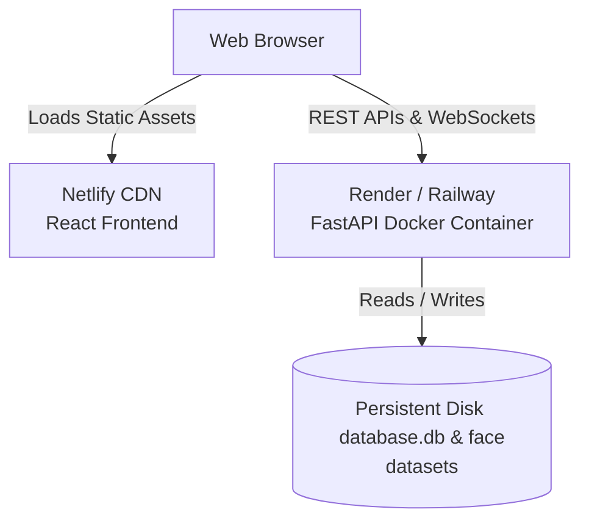

# Deployment Guide: AI Attendance System

This guide outlines how to deploy the **AI Attendance System** in a production environment. 

The system consists of two parts:
1. **Frontend (React + Vite)**: A static single-page application (SPA).
2. **Backend (FastAPI + OpenCV + SQLite)**: A Python web server that performs face recognition, reads/writes a local SQLite database, and handles WebSocket video streams.

---

## System Architecture for Production

Because Netlify is a **static hosting provider**, it can host the React frontend but **cannot run the FastAPI/Python backend**. 

To host the entire application:
1. **Frontend** is deployed to **Netlify** (free, fast, global CDN).
2. **Backend** is deployed to a container hosting provider that supports Docker (e.g., **Render**, **Railway**, **Fly.io**, or a **VPS** like DigitalOcean).

---

## Step 1: Deploy the Backend (Render / Railway / VPS)

You should deploy the backend first to obtain the backend URL, which you will need when configuring the frontend.

### Option A: Deploy on Render (Recommended & Free Tier Available)

Render automatically builds and runs the backend using the provided [Dockerfile](file:///c:/AI%20Attendance%20System/backend/Dockerfile).

1. **Push your code to GitHub/GitLab**.
2. Log in to [Render](https://render.com/) and click **New > Web Service**.
3. Connect your Git repository.
4. Set the following configuration:
   - **Name**: `ai-attendance-backend`
   - **Root Directory**: `backend` (if you are deploying from a monorepo)
   - **Runtime**: `Docker`
   - **Instance Type**: `Free` or `Starter`
5. **Attach a Persistent Disk** (Crucial to prevent losing SQLite data and face images):
   - Go to the **Disk** tab under your Web Service settings.
   - Click **Add Disk**.
   - **Name**: `attendance-data`
   - **Mount Path**: `/app/data`
   - **Size**: `1 GB` (or more)
6. **Configure Environment Variables**:
   - Go to the **Environment** tab and add:
     - `PORT`: `8000`
     - `SECRET_KEY`: `your-secure-random-jwt-secret-key`
     - `DATABASE_URL`: `sqlite:////app/data/database.db`
     - `UPLOADS_DIR`: `/app/data/uploads`
     - `DATASET_DIR`: `/app/data/dataset`
7. Click **Deploy Web Service**. Render will build the container, install OpenCV dependencies, and give you a public URL (e.g., `https://ai-attendance-backend.onrender.com`).

---

## Step 2: Deploy the Frontend (Netlify)

The React frontend has been optimized to dynamically parse the API base URL and support secure WebSocket (`wss://`) protocol configurations automatically.

### Configure Netlify Build Settings

1. Log in to [Netlify](https://www.netlify.com/) and click **Add new site > Import from an existing project**.
2. Connect your Git repository.
3. Configure the build settings for the monorepo:
   - **Base directory**: `frontend`
   - **Build command**: `npm run build`
   - **Publish directory**: `frontend/dist`
4. Add the following **Environment Variable** in Netlify:
   - **Key**: `VITE_API_BASE_URL`
   - **Value**: `https://your-deployed-backend-url.onrender.com/api/v1` (replace with your actual Render/Railway backend URL)
5. Click **Deploy Site**.

### Routing & Client-side Redirects (`_redirects`)
To support React Router's clean client-side URLs (e.g., `/dashboard`, `/history`) when page refreshes occur, a `_redirects` file has been automatically added to the frontend's [public folder](file:///c:/AI%20Attendance%20System/frontend/public/_redirects). Netlify uses this file to correctly route all traffic to `index.html`.

---

## Step 3: Verify the Production Setup

Once both services are deployed:
1. Open your Netlify site URL in your browser.
2. The login page should load, and requests will fetch information from your live backend.
3. Open the browser's developer console (F12) to verify there are no CORS or WebSocket protocol errors.
4. Try registering a student and taking attendance. The system will stream webcam frames directly from your browser to the secure FastAPI WebSocket backend, process it using SFace, and return real-time attendance markings.
